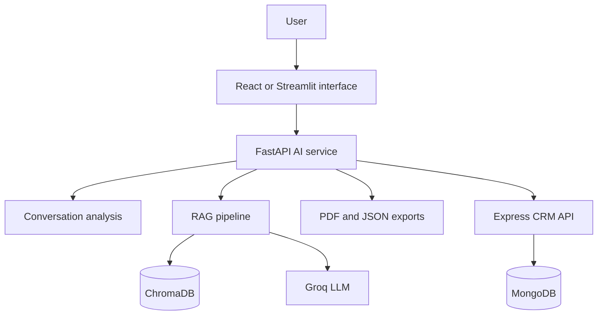

# AVA - AI-Assisted Medical Training and Visit Analytics

AVA is an academic prototype for pharmaceutical training and medical-visit simulation. It combines conversational analysis, retrieval-augmented generation (RAG), structured scoring, and automated reporting to help users review simulated conversations between medical representatives and healthcare professionals.

> **Scope:** AVA is a training and analytics prototype. It is not a medical device and must not be used for diagnosis, treatment, or clinical decision-making.

## What the project demonstrates

- End-to-end integration of a web interface, AI services, a CRM-style backend, and persistent storage.
- Multilingual conversation analysis for French, English, Arabic, and mixed-language inputs.
- Detection of objections, sentiment, interest, engagement, medical specialty, expressed needs, client profile, and proposed product.
- Visit scoring and generation of structured recommendations.
- RAG over local ChromaDB collections using multilingual sentence-transformer embeddings.
- LLM-assisted generation through the Groq API.
- Export of analysis results to JSON and PDF.
- Persistence of visit reports through an Express API and MongoDB.

## Architecture



## Main capabilities

### Conversation intelligence

The analysis pipeline processes a simulated representative-doctor conversation and produces structured fields such as:

- detected language and medical specialty;
- objections and suggested response strategies;
- sentiment and interest estimates;
- engagement indicators;
- expressed needs and proposed product;
- client typology;
- an overall visit score.

### Retrieval-augmented generation

The RAG service enriches the query, retrieves relevant documents from ChromaDB, removes duplicate results, ranks them by similarity, and supplies the selected context to an LLM. The current implementation uses:

- `paraphrase-multilingual-MiniLM-L12-v2` for embeddings;
- ChromaDB for local vector storage;
- `llama-3.3-70b-versatile` through Groq by default.

### Reporting and persistence

Analysis results can be:

- reviewed through the React or Streamlit interfaces;
- exported as PDF or JSON;
- sent to the CRM-style Express API;
- stored and queried in MongoDB.

## Technology stack

| Layer | Technologies |
| --- | --- |
| Frontend | React, TypeScript, Vite, Streamlit |
| AI API | Python, FastAPI, Pydantic |
| AI and NLP | Groq, sentence-transformers, rule-based extraction |
| Retrieval | ChromaDB, multilingual embeddings, RAG |
| CRM API | Node.js, Express, Mongoose |
| Data | MongoDB, local ChromaDB collections |
| Reporting | fpdf2, pypdf, JSON |

## Repository structure

```text
.
├── ai_backend/              # FastAPI endpoints, RAG and analysis services
├── backend/                 # Express/MongoDB report persistence API
├── frontendreact/           # React/TypeScript interface
├── frontendstreamlit/       # Streamlit prototype interface
├── fonts/                   # Fonts used for generated PDF reports
├── requirements.txt         # Python dependencies
├── test_*.py                # Prototype validation scripts
└── *.md                     # Technical notes and project documentation
```

## Configuration

Create a local `.env` file and keep it out of version control.

```env
GROQ_API_KEY=your_groq_api_key
GROQ_MODEL=llama-3.3-70b-versatile
CHROMA_PATH=ai_backend/rag/chroma_db
MONGO_URI=your_mongodb_connection_string
CRM_API_URL=http://localhost:5000/api/reports
FRONTEND_ORIGIN=http://localhost:5173
```

Never commit real credentials or connection strings. If a credential has previously been published, rotate it before using the project again.

## Running the Python prototype

```bash
python -m venv .venv

# Linux/macOS
source .venv/bin/activate

# Windows PowerShell
.venv\Scripts\Activate.ps1

pip install -r requirements.txt
uvicorn ai_backend.app:app --reload --port 8000
```

The FastAPI health endpoint is available at:

```text
http://localhost:8000/health
```

The Streamlit prototype can be started separately with:

```bash
streamlit run frontendstreamlit/app.py
```

## Reproducibility status

This repository is an archived academic prototype rather than a maintained production service. The Python dependency list is available, but the Node.js and React package manifests are not currently included. Those manifests must be restored before the Express and React components can be reproduced from a fresh clone.

The project has not been revalidated against the latest dependency versions. Setup may therefore require dependency adjustments. The included test scripts document prototype checks, but no current CI status or benchmark claim is provided.

## Limitations

- Several extracted attributes use keyword-based heuristics and should not be interpreted as clinically validated predictions.
- LLM output can be inaccurate and depends on the retrieved context.
- No production authentication or authorization layer is documented.
- No hosted demonstration is currently provided.
- Medical and pharmaceutical content requires expert validation before any real-world use.

## Future improvements

- Restore and lock the frontend and backend dependency manifests.
- Add automated unit and integration tests to CI.
- Add authentication and role-based access control.
- Introduce a formal evaluation dataset for extraction and RAG quality.
- Add tracing, latency monitoring, and cost monitoring for LLM calls.
- Containerize the complete stack for reproducible deployment.

## Additional documentation

The repository contains detailed technical notes for the BO5 reporting module, launch commands, usage guidance, and the evolution of the analysis pipeline.

## License

No open-source license has been declared. The code remains subject to the repository owner's copyright unless a license is added.
